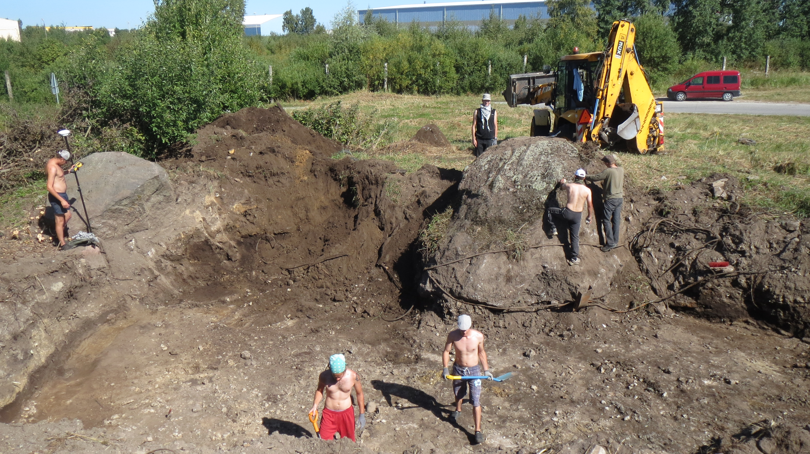
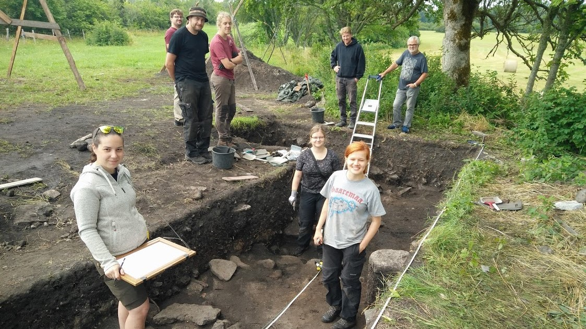
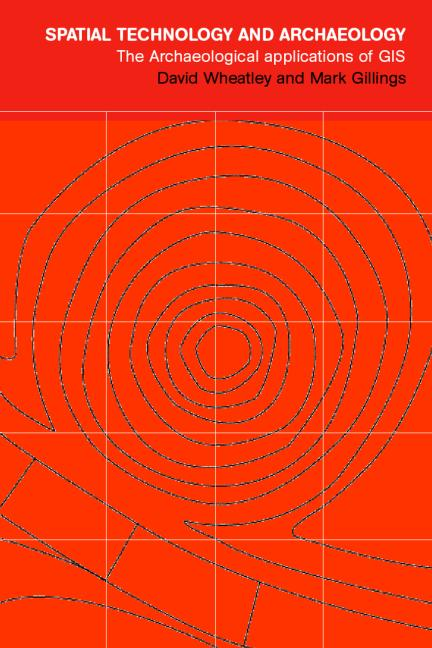

# Archaeology




---

# Archaeology 




---

# Archaeology

.pull-left[

]

.pull-right[

]
---

# Archaeology 

.pull-left[

]

.pull-right[

]

---

# Why GIS for archaeologists?

.pull-left[
- Numerous sites and find locations
- Often used only for simple visualisation 
- Less often used for analysis
- Sites and finds on the landscape
  - relations between them and their effects 
  - the environment in the past
- Planning fieldwork
]

.pull-right[

.caption[Archaeology using methods and tools from other disciplines?]
]

---

# GIS in archaeology


.pull-left[

]

.pull-right[

]

---

# GIS in archaeology

.pull-left[

]

.pull-right[

]

---

class: middle, up

# Sites

```{r, echo=FALSE, include=FALSE}
arh_mal = sf::st_read("C:/phd/estgis_2020/malestised_kpo_shp/arh_mal.gpkg", crs = 3301)
maakond = sf::st_read("C:/phd/estgis_2020/malestised_kpo_shp/maakond_20190101.shp")
```
```{r, echo=FALSE, message=FALSE, warning=FALSE, out.height="80%", out.width="80%"}

mal_plot = tmap::tm_shape(maakond) +
  tmap::tm_borders() +
  tmap::tm_shape(arh_mal) +
  tmap::tm_dots(col = "red")

mal_plot
```

---

# Sites


---

class: left, up

# Beginning of GIS in Estonian archaeology


.pull-left[
- Konsa, Marge. 1999. Geograafilise infosüsteemi kasutamine arheoloogias Rõuge kihelkonna näitel. Bachelor's thesis.
- sites on flat slopes or in depressions between larger landforms
- prefered aspect tends to be towards south
]

.pull-right[

]

---

class: left, up

# Analysing settlement patterns
.pull-left[
- Haav, Allar. 2013. Regional Settlement Pattern Analysis of South ‐ East Estonia : From The Pre ‐ Viking Age to Final Iron Age ( 6th – 13th cc). Master's thesis.
- Settlement sites in relation to their surroundings:
 - slope, aspect
 - solar irradiation
 - soil
 - distance from water
 - date
 - spatial interaction of settlements
]
.pull-right[

]
---

# Territories of hillforts in the 13th century

- Siig, Kristo . 2015. Ambiguous Territories: Reconstructing the political geography of Estonia in 1200 AD using the XTENT model. Master's thesis.
- Based on the yard area, date and volume of the rampart of the hillforts.

.pull-left[

]
.pull-right[

]

---

# Palaeogeograpchic reconstructions

.pull-left[

.caption[Narva-Luga area c 11.7 - 7.3 cal ka BP. Rosentau et al. 2013, fig 7.]
]

.pull-right[

.caption[Tallinn c 7.7 - 4.8 cal ka BP. Muru et al. 2017, fig 4.]]

# Viewshed analysis of cup-marked stones and stone graves


---

# Viewshed analysis of cup-marked stones and stone graves 


---

# Viewshed analysis of cup-marked stones and stone graves

.pull-left[

.caption[Visibility of cup-marked stones' locations compared to the surroundings]
]

.pull-right[

.caption[Visibility of stone graves' locations compared to the surroundings]
]

---

# Sound of making the cup-marks


---

# LiDAR data and archaeological sites


---

# LiDAR data and archaeological sites


---

# LiDAR data and archaeological sites


---
class: up

# Agent-based modeling of early agriculture


---

class: center, middle

# Thank you for your attention!

**Thank you for your attention!**


andres.kimber@muinsuskaitseamet.ee

andres.kimber@ut.ee

@andreskimber
 
 
---

# References

Haav, A. (2013). Regional Settlement Pattern Analysis of South ‐ East Estonia : From The Pre ‐ Viking Age to Final Iron Age ( 6 th – 13 th cc .). University of Southampton. Master's thesis.

Kimber, A. (2016). Lohukivid, vaated ja helid muistsel maastikul. Tutulus: Eesti Arheoloogia Aastakiri, 44–46.

Muru, M., Rosentau, A., Kriiska, A., Lõugas, L., Kadakas, U., Vassiljev, J., Saarse, L., Aunap, R., Küttim, L., Puusepp, L., & Kihno, K. (2017). Sea level changes and Neolithic hunter-fisher-gatherers in the centre of Tallinn, southern coast of the Gulf of Finland, Baltic Sea. Holocene, 27(7), 917–928. https://doi.org/10.1177/0959683616678462

Rosentau, A., Muru, M., Kriiska, A., Subetto, D. A., Vassiljev, J., Hang, T., Gerasimov, D., Nordqvist, K., Ludikova, A., Lõugas, L., Raig, H., Kihno, K., Aunap, R., & Letyka, N. (2013). Stone Age settlement and Holocene shore displacement in the Narva-Luga Klint Bay area, eastern Gulf of Finland. Boreas, 42(4), 912–931. https://doi.org/10.1111/bor.12004